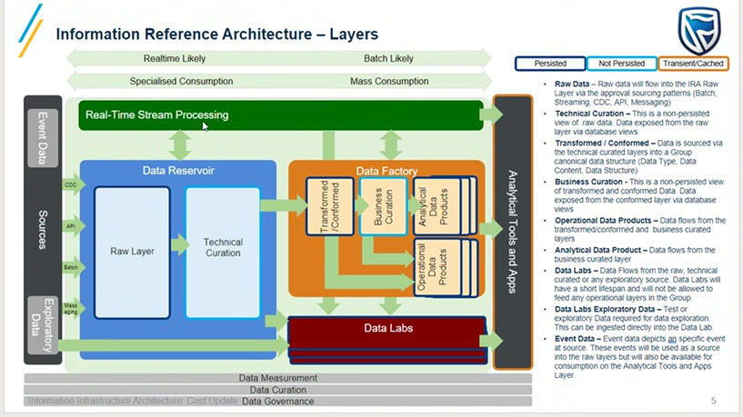

- Finance Cloud Migration Meeting #meeting #Finance-Cloud-Migration
  collapsed:: true
	- Attendees
	  collapsed:: true
		- [[McAlpine, Alwyn A]]
		- [[Vlok, Ruan R]]
		- [[Phatsoane, Bonolo B]]
		- [[Hefer, Annemarie A]]
		- [[Coetzee, Inus I]]
		- [[Keevy, John J]]
	- Conversation:
		- [[Vlok, Ruan R]]
			- Source system is Murex
			- Start with "pure" finance stuff?
			- What approval needed to get into cloud?
				- 3/4 Committees?
				- Awaiting feedback from Jason about required approval.
		- [[McAlpine, Alwyn A]]
			- Subledger Data.
			- Bank Analyzer -> data stored in another DB.
			- There might be privacy concerns (their data and also not their data).
		- [[Vlok, Ruan R]]
			- Certain elements owned in data .
		- [[McAlpine, Alwyn A]]
			- Bank Analyzer (3rd layer) best bet to start with.
			- Most others permission would be an issue.
			- Only a small fraction on the list would be fine (no perm issues).
			- (? what is the "3rd layer" wrt to Bank Analyzer data).
			- No 3rd layer data seems to be on the list.
		- [[Vlok, Ruan R]]
			- Look for GBM, fusion, subledger, oracle, FMI (db2db pattern) on table name in list.
		- [[Keevy, John J]]
			- Pick anyone for POC.
		- [[Coetzee, Inus I]]
			- File Layout etc.
- GRES/RES Data Discussion Cloud Migration #meeting #GRES-Cloud-Migration
  id:: 63d12170-c9f6-436c-a4cf-360ee01f3127
  collapsed:: true
	- Attendees
		- [[Naidoo, Aveshen A]]
		- [[Jones, Megan M]]
		- [[Venter, Lyndie LS]]
		- [[Msimanga, Monica MN]]
		- [[Swanepoel, Werner W]]
		- [[Molotsi, Yvonne Y]]
	- Conversation
		- 
		- [[Naidoo, Aveshen A]]
			- Everything they need sits in the [[IRA]].
			- How we use the [[IRA]]?
			- Who does ingestion/execution?
		- [[Vlok, Ruan R]]
			- 2 Year cloud journey - [[IRA]] Cloud capabilities.
			- Current challenge is the approval process to get the data into the cloud.
			- Capacity also big issue - no engineers to do the work.
			- ETS attempt - central execution - then federated execution.
			- Ingestion of RAW data is NOT self-service (centrally executed).
			- DONE Document of [[IRA]] components : https://aws-tools.standardbank.co.za/confluence/display/DSD/IRA+Cloud+Implementation
			- Blue-block - mainly RAW data sourced via patterns that we support (CDC, replication, batch, api, streaming, etc evolving).
				- Source-Store-Serve pattern.
			- Data products have been decoupled physically.
				- Teams using DPs have more autonomy (use whatever you want).
			- Data labs
			- Data sourced from Azure, AWS, on-prem, etc.
			- Proper cataloguing.
			- Security
				- Data manager of GRES manages access to the data (logical access model signed off by security officer).
				- Process is onboarded onto MyAccess.
			- Formal structure/process how we will work with you to do the onboarding.
				- Get sufficient information up-front.
				- Allocate portfolio leads to the process.
				- Cost-decision trees.
				- What other components needed to work in parallel.
				- Only work with blue-block components.
				- Only advise on the other components/areas.
		- [[Naidoo, Aveshen A]]
			- What DPs and what source systems we know.
			- Plan a book of work with John.
			- Who does the enablement of the orange block?
		- [[Vlok, Ruan R]]
			- In DP there might be specific information sets like mapping table, etc (only means something when used with the DP) - this data we don't want in the blue block.
			- Can put API's on the orange block and serve the data from there (they can choose to do this).
		- [[Venter, Lyndie LS]]
			- What is the orange block?
		- [[Vlok, Ruan R]]
			- You need dedicated data engineers to execute on the orange block.
			- Orange block - own your own subscription, data factory, processes, etc.
			- Pushing Azure Synapse ecosystem.
			- We are working on a blueprint framework which is optional to use.
			- We use synapse, databricks, data factory, etc to serve data.
			- We will step back if you choose not to use what we have to offer.
		- [[Msimanga, Monica MN]]
			- I'm the data manager for the team.
			- How she must interface with [[Keevy, John J]]?
		- [[Vlok, Ruan R]]
			- Collaborative session should be had.
			- DONE We working with Peggy's team - (Who is Peggy's team?) #clarify
			- Liezl's team works well on federated execution.
		- [[Venter, Lyndie LS]]
			- Orange block
				- Data factory - data flows with Jaycee (data architecture).
		- [[Vlok, Ruan R]]
			- DONE Jaycee looks after us (who is Jaycee?)
			- Have a look at the confluence pages (everything is documented there).
		- [[Venter, Lyndie LS]]
			- Governance - when looking at factory piece of work, prereqs
				- CRM process must be complete.
				- Data purity needs to be signed off and approved.
		- [[Vlok, Ruan R]]
			- Minimum set of reqs for data in orange block.
			- You are responsible for min-requirements in your subscription.
			- If the data moves out of the blue-block, we are no longer responsible to secure it.
			- DONE set up session with Peggy, Sandy, Aveshen, Monica, etc from this meeting.
			  :LOGBOOK:
			  CLOCK: [2023-01-25 Wed 15:04:59]--[2023-01-26 Thu 09:02:33] =>  17:57:34
			  :END:
			- Trigger formal engagement with John on the process.