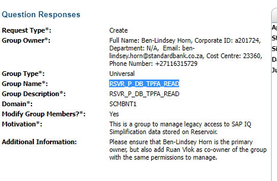

- [[Escalation Dashboard Requirement]] #meeting
  collapsed:: true
	- Attendees:
		- [[Stander, Barend B]]
		- [[Sibiya, Sphelele S]]
		- [[Yeshagol, Aloknath A]]
		- [[Raidani, Lusani L]]
		- [[Scullard, Megan]]
		- [[Vlok, Ruan R]]
		- [[Mestovski, Aleksey A]]
		- [[Hefer, Annemarie A]]
		- [[Tshivhase, Livhuwani L]]
		- [[Horn, Ben-Lindsey BL]]
		- [[Persadh, Arnold A]]
		- [[Ratlhagane, Katlego K]]
	- Notes:
		- [[Sibiya, Sphelele S]]
			- Requirement - escalation data from customer first stored in repository to get to dashboard (dashboard managed by [[Tshivhase, Livhuwani L]]).
			- Data includes escalation levels (1-5), actual service request escalated from and to who, hours, complaint type. No ID numbers, personal info, etc.
		- [[Yeshagol, Aloknath A]]
			- SAP BW - connect direct - ?
			- Where will the data land on?
		- [[Vlok, Ruan R]]
			- Is this requirement in line with the group data architecture for batch?
			- Strategy for group data architecture which we are enabling.
			- We don't just give people servers and DBs.
			- We don't do database as service or storage account as a service.
			- Move data to cloud - create storage accounts - enable serving layer from which dashboards would access the data.
			- Data Services enablement that is aligned with the group data architecture.
			- Is this an [[IRA]] use-case or something else?
		- [[Stander, Barend B]]
			- The current solution is not sustainable.
			- Happy to support the best approach.
		- [[Vlok, Ruan R]]
			- Batch extract out of BPM? (correct)
			- Passed in IRA framework into cloud.
			- This is the strategically-aligned way to design this.
			- What changes would this entail?
		- [[Yeshagol, Aloknath A]]
			- Have not done this before.
			- Data always been house on on-prem architecture.
			- Need to know how the SAP team is going to transfer data to the cloud.
			- IT Security point of view - do we need some kind of approval or signoff from them?
			- Expose URL that is some kind of database service.
		- [[Vlok, Ruan R]]
			- Transfer will happen via sterling file gateway into storage account.
			- Link for IRA from [[Hefer, Annemarie A]]
			- Data into parque format
			- Synapse serverless SQL pool to expose data via open...?
			- Would still have database connection to access the data.
			- No concerns from a technical security perspective.
		- [[Stander, Barend B]]
			- [[Ratlhagane, Katlego K]] pulled in as data steward, but not the real data steward.
		- [[Vlok, Ruan R]]
			- Assessment required to confirm governance processes in your area.
			- What needs to be done from a business perspective?
			- Your security officer to give go-ahead.
			- Formats of files, plain delimited, etc?
			- POC/MVP1.
		- [[Vlok, Ruan R]]
			- Work must be tracked and managed.
			- Engagement model for new demand - run as formal piece of work under our structure ([[Keevy, John J]]).
			- Not done as an informal engagement - we don't want any initial take-on to not be successful.
			- This is shaping/pipeline discussion.
		- [[Yeshagol, Aloknath A]]
			- Sterling File Gateway?
			- SAP BW still used to pull data from BPM?
		- [[Vlok, Ruan R]]
			- Sterling File Gateway - Managed File Transfer (replaces Connect Direct)
			- SFG picks up file from a specified location and moves it into the cloud.
			- We work closely with the SFG team to set up connections (already set up).
			- Discussion must be passed on to [[Keevy, John J]].
		- [[Yeshagol, Aloknath A]]
			- Include tech team and other people to ensure we are all aligned.
			- Confirm from SAP BW resource that they will be able to land the source file.
- [[DP-? - Bad, bad query! (WhTPSExposuresandLimits)]]
- [[SQL Server Instances]]
- Remedy Request Issue
	- 
	- **Group Type*:** Universal
	- **Group Name*:** RSVR_P_DB_TPFA_READ
	- **Group Description*:** RSVR_P_DB_TPFA_READ
	- **Domain*:** SCMBNT1
	- **Motivation*:**  This is a group to manage legacy access to SAP IQ Simplification data stored on Reservoir.
	- **Additional Information:** Please ensure that Ben-Lindsey Horn is the primary owner, but also add Ruan Vlok as co-owner of the group with the same permissions to manage.