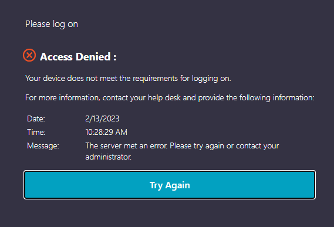

- Citrix Access Error:
	- 
	- A201724
- P1
  collapsed:: true
	- Lord, as I read through this chapter, my focus today falls on the author's warning of having and "and" behind "God." Does my motives say "God, and...?" And if there is an "and," what is it? Father, you say in the book of James that, if we lack wisdom, we should ask it of you, and ask it without any doubting. I believe, forgive my unbelief. Grant me the faith to ask, with the full expectancy of receiving an answer. Let me ask, fully believing that I already have what I have asked for.
	- Lord, if there is any "and" in my heart, in my mind, in my motives, in my motivations, please forgive me. Please point it out to me, and help me, gently, to rid myself of it. To come to you in simplicity, seeking nothing but you. Not your gifts, not your blessings, not your protections, not your peace, or joy or freedom, or safety. But seeking YOU, and only you. Seeking you for who you are as you've revealed in your Word.
	- Give me a holy desire for you, for apart from you stirring my heart to want you, I would want nothing other than worldly and fleshly pleasures.  My whole life is a testimony to this fact. I am lost, when it comes to desire, to my own passions and desires and lusts, unless you come and free me from these, and grant me the ability and the desire, to want you instead.
	- I pray for Jonathan also, that you would grant him this same simplicity. This same self-evaluation and Godly revelation of whatever form his "and" might take. Make him aware of his "and's" and his lack of want and desire for you. Help him cry out to you to give him those things, and a faith that believes that you are, and that you are a rewarder of those who seek you.
	- Thank you for changing me already to the degree that I have witnessed so far. Please forgive my mechanicalness and dutiful way of doing things which so often lack true motive and desire and feeling. But I am fully assured that, even where we lack desire, this does not absolve us from our duty. We must still do, and we must seek you and implore you to grant us the corresponding desire. And that is my prayer. That you would see the little faith I have, see the little duty and diligence with which I am coming to you, and then to bless me with true desire, true feeling, true emotion, and that you would show me your glory. Show me your face. Make me feel your presence and your grace and glory rest on me.
	- Thank you for this wonderful opportunity - to be able to come to you openly and honestly, confessing my sin and my lack of holy desire, my lack of true and loving motivation, and then to depend solely on you to grant me these things. To change me so that I may truly love you and want you.
	- You are a promise keeper. You are a rewarder of those who seek you.
	- I am seeking, Father. Show me your glory.
	- Amen.
- Sprint Panning Session #meeting
	- [[Habana, Varilon V]]
		- RPP - Rapid Payments Program deployment.
		- Change in Tool Production files for Diners - additional fields added to source.
		- Intersect Data Product - table needs to be sorted out.
	- [[Malapela, Lehlohonolo L]]
		- Curated views for Annemarie.
		- ProWatch curated views for access control.
	- [[Mhlanga, Nomaseko N]]
		- Rename 14 Curated views for Maven on DEV & PROD.
	- [[Buda, Clive C]]
		- Continuous task - USSD data session.
		- Data to be ingested OR what are the next steps.
	- [[Nxumalo, Sibusiso S]]
		- Wealth demand.
		- New ingestion for Snapscan.
		- Schema to be created.
		- Curated view.
	- [[Mxube, Mambai NJ]]
		- PBB DQ setup for write-backs.
		- Same thing must happen for DQ results.
		- Database is insurance.
		- This demand is then for [[Mannya, Stanford S]] .
	- [[Gottlieb, Dallan D]]
	- [[Shikwambana, Lesego L]]
		- 1 Curated View for Maven on DEV and PROD.