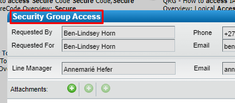

- Log in to Remedy's Service Request Management.
- Log a "Security Group Access" request.
	- 
- Select "Create" from the **Request Type** dropdown list.
- Select "Global" from the **Group Type** dropdown list.
- Specify the **Group Name** following correct naming standards and conventions.
- Select "Yes" from the **Modify Group Members?** dropdown list.
- Supply all other required information.