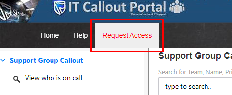
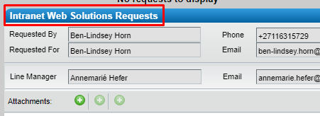

- Go to the Callout Portal
	- https://calloutportal-standardbank.msappproxy.net/Applications/CalloutPortalRefresh/
- Click on **Request Access**.
	- 
- You will be redirected to Remedy's Service Request Management.
- Log an "Intranet Web Solutions Requests" request.
	- 
- Select "Add team to call out" in the **Category** drop down list.
- Specify the **Remedy Support Group** created previously.
- Specify the Callout Portal URL in the field **URL (link) to site where this will be used**
	- https://calloutportal-standardbank.msappproxy.net/Applications/CalloutPortalRefresh/
- Supply any additional information requested.