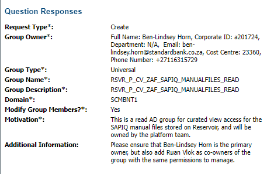

- [Metadata Sheet v1](../assets/Reservoir_Data_Curation_-_vwCuratedZAFReSnapScanAccountOrigination_1677141283644_0.xlsx)
- [Metadata Sheet v2](../assets/Reservoir_Data_Curation_-_vwCuratedZAFReSnapScanAccountOrigination_(1)_1677145853007_0.xlsx)
- AD Group:
	- 
	- REQ000003166213
	- RSVR_P_CV_ZAF_SNAPSCAN_READ
	- Motivation*:	This is a read AD group for curated view access for the SAPIQ manual files stored on Reservoir, and will be owned by the platform team.
	  Additional Information:	Please ensure that Ben-Lindsey Horn is the primary owner, but also add Ruan Vlok as co-owners of the group with the same permissions to manage.
	- Data Steward: [[Parkin, Paula PM]]