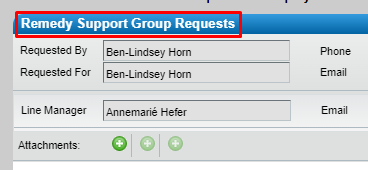

- Complete the "Support Group User Template" spreadsheet with a list of users to be added to the Remedy Team.
  collapsed:: true
	- https://standardbank.sharepoint.com/:x:/r/sites/teams/GS/GroupIT/GTSS/Run/ITSM/PnT/Remedy%20Technical%20Documents/ITSM%20Templates%20for%20SRM/Support%20Groups/Support%20Group%20Users.xlsx
	- Note: Before access to the Remedy Team will be granted, all the users need to complete the ITSM training.
		- Log in to PeopleFluent - Learning and Development.
		  collapsed:: true
			- [Human Capital Home (peoplefluent.eu.com)](https://standardbankst.peoplefluent.eu.com/st/v2/dashboard)
		- Search for and complete the module "Remedy Incident Management (212007)"
		  collapsed:: true
			- 
	- The Remedy request is cancelled if no list is supplied within 3 days.
- Log in to Remedy's Service Request Management.
- Log a "Remedy Support Group Requests" request.
	- {:height 178, :width 368}
- Select "Support Group" from the **Group Request Type** dropdown list.
- Select "Create" from the **Request Type** dropdown list.
- Select "Incident Management" in the **Remedy Module/s** options.
- Supply all other required information.