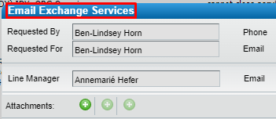

- Log in to Remedy's Service Request Management.
- Log an "Email Exchange Services" request.
	- {:height 160, :width 351}
- Select "Distribution List Services" from the **Exchange Service Type** dropdown list.
- Select "Create" from the **Request Type** dropdown list.
- Supply all other required information.